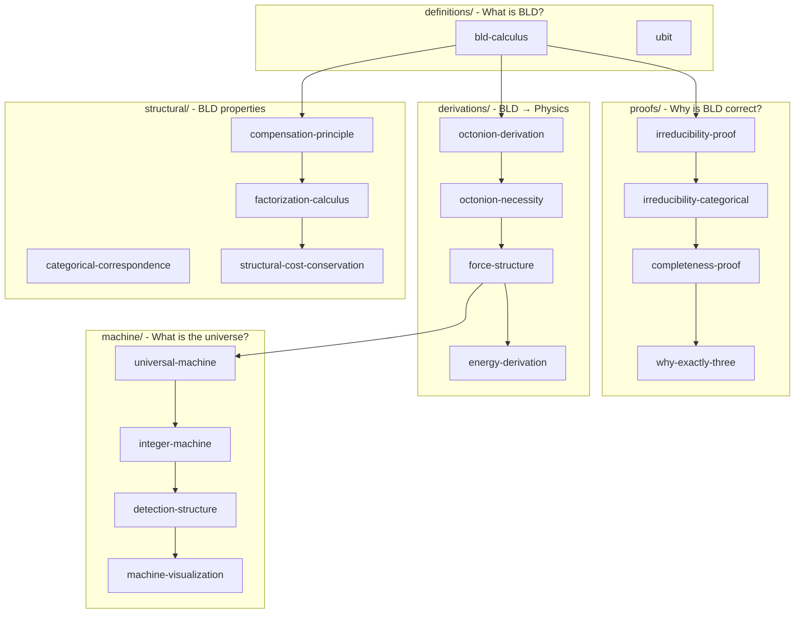

## Summary

**The foundational layer of BLD theory:**

1. Core constants: B=56, L=20, n=4, K=2, S=13 — [Core Terms](#core-terms)
2. Dependency structure shows how concepts build on each other — [Dependency Diagram](#dependency-diagram)
3. Four reading paths: Foundations, Core Theory, Physics, Machine — [Reading Order](#reading-order)
4. Key results include irreducibility, completeness, and all four forces derived — [Key Results](#key-results)
5. Files organized by question: What is BLD? Why correct? How gives physics? — [Folder Structure](#folder-structure)

# BLD Foundations

**Layer 0-1**: Core axioms and theorems that establish BLD as a formal system.

**Start here**: [constants.md](constants.md) — All BLD constants (B=56, L=20, n=4, K=2, S=13) with derivation links.

**Quick reference**: [key-formulas.md](key-formulas.md) — All major formulas (α⁻¹, sin²θ_W, α_s, E=K×Σ(1/Xᵢ)).

---

## Core Terms

| Term | Meaning | Value |
|------|---------|-------|
| **B** | Boundary (Sum/Partition) — discrete distinction | 56 |
| **L** | Link (Function/Reference) — connection | 20 |
| **D** | Dimension (Product/Repetition) — extent | n=4 |
| **K** | Killing form (bidirectional observation cost) | 2 |
| **S** | Structural intervals = (B−n)/n | 13 |
| **X** | Structure traversed (varies by measurement) | varies |
| **traverse** | Move through structure, paying K/X cost | K/X |

---

## Dependency Diagram



---

## Folder Structure

```
foundations/
├── README.md              (this file)
├── axioms.md              (Layer 0: foundational axioms A1-A7)
├── notation.md            (Layer 0: standard notation guide)
├── constants.md           (cross-cutting: used by all)
├── discovery-method.md    (cross-cutting: Q1/Q2/Q3 methodology)
├── key-formulas.md        (cross-cutting: all major formulas)
│
├── definitions/           "What is BLD?"
│   ├── bld-calculus.md      (B=Sum, L=Function, D=Product)
│   └── ubit.md              (1 BL pair = minimum structure)
│
├── proofs/                "Why is BLD correct?"
│   ├── irreducibility-proof.md
│   ├── irreducibility-categorical.md
│   ├── completeness-proof.md
│   └── why-exactly-three.md
│
├── derivations/           "How does BLD give physics?"
│   ├── octonion-derivation.md
│   ├── octonion-necessity.md
│   ├── force-structure.md
│   └── energy-derivation.md
│
├── machine/               "What is the universe?"
│   ├── universal-machine.md
│   ├── integer-machine.md
│   ├── detection-structure.md
│   └── machine-visualization.md
│
└── structural/            "What are BLD's properties?"
    ├── compensation-principle.md
    ├── categorical-correspondence.md
    ├── factorization-calculus.md
    ├── structural-cost-conservation.md
    └── canonical-hardness.md
```

## Proof Status

| Status | Count | Meaning |
|--------|-------|---------|
| PROVEN | 6 | Formal proof using type theory or logic |
| DERIVED | 15 | Follows from BLD axioms, not fully formalized |
| VALIDATED | 1 | Matches empirical data |

**When files contradict**: Lower layers win (Layer 0 > Layer 1).

## Contents by Cluster

### Foundation (Layer 0)
| File | Status | Description |
|------|--------|-------------|
| [axioms.md](axioms.md) | PROVEN (Layer 0) | The seven foundational axioms (A1-A7) |
| [notation.md](notation.md) | DERIVED (Layer 0) | Standard notation and conventions |

### Cross-Cutting (Top Level)
| File | Status | Description |
|------|--------|-------------|
| [constants.md](constants.md) | DERIVED (Layer 0) | All BLD constants with derivation links |
| [discovery-method.md](discovery-method.md) | DERIVED (Layer 0) | The Q1/Q2/Q3 discovery method applied to physics |
| [key-formulas.md](key-formulas.md) | DERIVED (Layer 0) | All major formulas (α⁻¹, sin²θ_W, α_s, E, K/X) |

### definitions/ — "What is BLD?"
| File | Status | Description |
|------|--------|-------------|
| [bld-calculus.md](definitions/bld-calculus.md) | PROVEN (Layer 0) | Foundational type system: B=Sum, L=Function, D=Product |
| [ubit.md](definitions/ubit.md) | DERIVED (Layer 1) | Universal Bit: 1 BL pair = minimum structure |

### proofs/ — "Why is BLD correct?"
| File | Status | Description |
|------|--------|-------------|
| [irreducibility-proof.md](proofs/irreducibility-proof.md) | PROVEN (Layer 1) | B, L, D cannot express each other |
| [irreducibility-categorical.md](proofs/irreducibility-categorical.md) | PROVEN (Layer 1) | Formal categorical proof of irreducibility |
| [completeness-proof.md](proofs/completeness-proof.md) | PROVEN (Layer 1) | B, L, D are sufficient (Lie + Turing routes) |
| [why-exactly-three.md](proofs/why-exactly-three.md) | DERIVED (Layer 1) | Why exactly three primitives (not more, not fewer) |

### derivations/ — "How does BLD give physics?"
| File | Status | Description |
|------|--------|-------------|
| [octonion-derivation.md](derivations/octonion-derivation.md) | PROVEN (Layer 1) | BLD → division algebras → octonions → n=4, SU(3), 3 gen |
| [octonion-necessity.md](derivations/octonion-necessity.md) | DERIVED (Layer 1) | Why octonions are required (genesis closure argument) |
| [force-structure.md](derivations/force-structure.md) | DERIVED (Layer 1) | All four forces from division algebra tower + K/X costs |
| [energy-derivation.md](derivations/energy-derivation.md) | DERIVED (Layer 1) | Energy = accumulated K/X = observation scope |

### machine/ — "What is the universe?"
| File | Status | Description |
|------|--------|-------------|
| [universal-machine.md](machine/universal-machine.md) | DERIVED (Layer 1) | traverse(-B, B) as cosmic computation (abstract) |
| [integer-machine.md](machine/integer-machine.md) | DERIVED (Layer 1) | Universe computes in boundary ops |
| [detection-structure.md](machine/detection-structure.md) | DERIVED (Layer 1) | The T ∩ S formalism for observer corrections (+/−) |
| [machine-visualization.md](machine/machine-visualization.md) | DERIVED (Layer 1) | Ring and Cloth model |

### structural/ — "What are BLD's properties?"
| File | Status | Description |
|------|--------|-------------|
| [compensation-principle.md](structural/compensation-principle.md) | PROVEN (Layer 1) | L compensates for B deficiency (not vice versa) |
| [categorical-correspondence.md](structural/categorical-correspondence.md) | DERIVED (Layer 1) | BLD = Category Theory (B=coproduct, L=morphism, D=product) |
| [factorization-calculus.md](structural/factorization-calculus.md) | DERIVED (Layer 1) | FACTOR operation on structures |
| [structural-cost-conservation.md](structural/structural-cost-conservation.md) | DERIVED (Layer 1) | Cost algebra and conservation |
| [canonical-hardness.md](structural/canonical-hardness.md) | VALIDATED (Layer 1) | Finding minimal BLD is NP-complete |

## Reading Order

### Path 0: Foundations (Start Here)
0. **Axioms**: `axioms.md` — the seven foundational axioms
1. **Notation**: `notation.md` — standard symbols and conventions

### Path 1: Core Theory (Required)
2. **Start**: `definitions/bld-calculus.md` — definitions of B, L, D
3. **Then**: `proofs/irreducibility-proof.md` — why all three are needed
3. **Then**: `proofs/irreducibility-categorical.md` — formal categorical proof
4. **Then**: `proofs/completeness-proof.md` — why three is enough
5. **Then**: `proofs/why-exactly-three.md` — why no fourth exists
6. **Then**: `structural/categorical-correspondence.md` — BLD = Category Theory

### Path 2: Physics Connection (After Path 1)
7. **Start**: `derivations/octonion-derivation.md` — division algebras → n=4, SU(3), 3 gen
8. **Then**: `derivations/octonion-necessity.md` — why octonions are REQUIRED (closure)
9. **Then**: `derivations/force-structure.md` — all four forces from K/X

### Path 3: Structural Principles (After Path 2)
10. `structural/compensation-principle.md` — L compensates B
11. `derivations/energy-derivation.md` — E = K × Σ(1/Xᵢ)
12. `discovery-method.md` — the Q1/Q2/Q3 methodology

### Path 4: The Universal Machine (Advanced)
13. `machine/universal-machine.md` — traverse(-B, B) as computation
14. `machine/detection-structure.md` — the T ∩ S formalism
15. `machine/integer-machine.md` — boundary-based computation
16. `machine/machine-visualization.md` — Ring and Cloth model
17. `definitions/ubit.md` — the universal bit

## Key Results

- **B, L, D are irreducible**: None can express another (proven)
- **B, L, D are complete**: Sufficient for all observable structure (proven)
- **Three is both minimal and maximal**: Complete structural basis
- **BLD = Category Theory**: B=coproduct, L=morphism, D=product (derived)
- **BLD requires octonions**: Genesis closure requires B=56 modes (derived)
- **SU(3) is derived**: From octonion necessity, not observed (derived)
- **L compensates B**: Links can approximate boundaries, not vice versa (proven)
- **All four forces derived**: From division algebra tower + K/X costs (derived)
- **Energy derived**: E = K × Σ(1/Xᵢ) = observation scope (derived)
- **Cascade ratio λ = 1/√20**: From S₃ cascade (Catalan C₃=5), see [scale-derivation.md](../cosmology/scale-derivation.md)
- **Universe is a machine**: traverse(-B, B) = cosmic computation (derived)

---

## Frontmatter Schema

All files in foundations use this YAML frontmatter format:

```yaml
---
status: PROVEN | DERIVED | VALIDATED
layer: 0 | 1 | 2
depends_on:
  - relative/path/to/dependency.md
used_by:
  - relative/path/to/dependent.md
# Optional: for conceptual two-reference closures (breaks circular proof deps)
see_also:
  - relative/path/to/related.md
# Optional: explicit reading prerequisites
prerequisites:
  required:
    - definitions/bld-calculus.md
  recommended:
    - proofs/irreducibility-proof.md
---
```

| Field | Required | Description |
|-------|----------|-------------|
| `status` | Yes | PROVEN (formal proof), DERIVED (follows from axioms), VALIDATED (matches data) |
| `layer` | Yes | 0 = axiomatic, 1 = derived, 2 = application |
| `depends_on` | Yes | Files this file logically depends on (proof ordering) |
| `used_by` | Yes | Files that depend on this file |
| `see_also` | No | Related files (conceptual, not proof dependency) |
| `prerequisites` | No | What to read first (required vs recommended) |

**Note**: `depends_on` creates proof DAG; `see_also` is for conceptual links that don't affect proof ordering.
